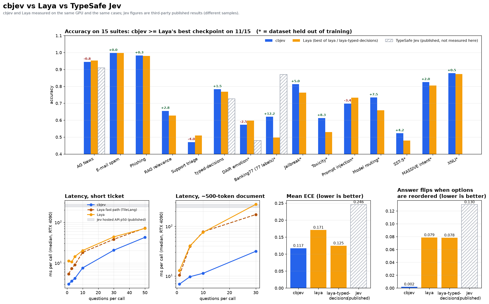

<p align="center">
  <picture>
    <source media="(prefers-color-scheme: dark)" srcset="assets/logo-lockup-dark.png" />
    
  </picture>
</p>

<p align="center"><b>Typed decisions — <code>choice</code>, <code>score</code>, <code>noul</code> — about any text or JSON state, from one encoder pass.</b><br/>
Every question of a call shares one encoding of the state: 3 ms for one question, 11 ms for ten questions over a 500-token document.<br/>
A self-hosted, Jev-compatible, faster and better-calibrated successor to <a href="https://github.com/NandhaKishorM/laya">Laya</a>.</p>

<div align="center">

[](LICENSE)
[](pyproject.toml)
[](https://pytorch.org)
[](https://tomek7667.github.io/cbjev/)
[](BENCHMARKS.md)
[](NOTICE)

</div>

<p align="center">
  
</p>

## Results at a glance

Measured on one RTX 4090, cbjev and Laya side by side on byte-identical cases ([BENCHMARKS.md](BENCHMARKS.md)).
Jev numbers are third-party published figures; there was no TypeSafe API access, so they are indicative only.

| | cbjev | Laya (best of its checkpoints) | TypeSafe Jev (published) |
|---|---|---|---|
| **mean accuracy, 15 English suites** | **0.741** | 0.710 (laya-typed-decisions) | — |
| suites where cbjev >= Laya's better checkpoint | **11 / 15** | | |
| typed-decisions, 2,000 decisions | **0.783** | 0.768 | 0.727 |
| AG News | 0.945 | **0.953** | 0.910 |
| DAIR emotion (held out) | 0.573 | **0.598** | 0.480 |
| Banking77, all 77 labels in one question (held out) | 0.620 | 0.497 | **0.870** (72 labels) |
| mean ECE (lower is better) | **0.117** | 0.125 | 0.246 |
| answer flips when options are reordered | **0.2 %** | 7.8 % | 13 % |
| MASSIVE intent, 51 languages, macro accuracy | **0.436** | 0.401 | — |
| MASSIVE, languages where cbjev >= Laya | **45 / 51** | | |
| 1 question, short ticket | **3.0 ms** | 5.4 ms (TileLang fast path) | 236–276 ms (hosted API) |
| 10 questions, short ticket | **7.5 ms** | 18.2 ms | |
| 10 questions, ~500-token document | **11.4 ms** | 75.8 ms | |
| 30 questions, ~500-token document | **31.4 ms** | 172.4 ms | |

cbjev is faster than both Laya paths in every one of the 10 latency cases measured, by 1.5x (one
question on a long document) to 6.9x (ten questions on a document).

---

## What is different from Laya

Laya encodes the state once **per question**: ten questions about a 500-token document means ten
500-token sequences. cbjev packs a call into one row — the state once, then every question as its
own segment:

```
Laya   [CLS] q1 [SEP] opts [SEP] state [SEP]      (x N questions)
cbjev  [CLS] q1 | q2 | ... | qN | state [SEP]     (once)
```

The attention mask keeps questions from seeing each other, while the state reads all of them. Each
question segment restarts its positions right after `[CLS]`, so with a single question the row is
token-for-token and position-for-position exactly what a Laya checkpoint was trained on — which is why
fine-tuning from Laya starts from Laya's full ability instead of relearning it.

On top of that:

* **Own encoder forward.** A from-scratch ModernBERT/mmBERT implementation (`cbjev/model.py`) with an
  explicit attention mask, bf16 matmuls over an fp32 residual stream, and **CUDA-graph replay per
  shape bucket** (`cbjev/engine.py`) — a call is one graph launch instead of ~300 kernel launches.
* **Cheaper CPU side.** The state is tokenized once per call, question text is tokenized once and
  cached, and everything is shipped to the GPU in one pinned copy.
* **Retrained checkpoints.** Fine-tuned from Laya on 35 public datasets in many question framings,
  distilled against both English Laya checkpoints, with temperatures fitted on a held-back dev split.
* **Optional order voting.** `cbjev.load(order_votes=2)` also asks every choice/score question with its
  options reversed and averages the answers — one extra short segment, not another pass.
* **Laya checkpoints still run.** `cbjev.load("laya")` runs the original weights in their own layout
  (verified to match Laya's probabilities within bf16 rounding).

## Install

```bash
python -m venv .venv
.venv/bin/pip install -e .            # core
.venv/bin/pip install -e ".[serve]"   # + HTTP server
```

Weights: point `CBJEV_HOME` (default `~/.cache/cbjev`) at a directory holding `cbjev/` and
`cbjev-multilingual/`, or pass a path to `cbjev.load(...)`. They are produced by `training/`
(see [Training](#training)).

## Quickstart

```python
import cbjev

agent = cbjev.load()                                   # English checkpoint, GPU if available
res = agent.predict(
    {"subject": "Duplicate charge on invoice #4411",
     "body": "We were billed twice for March. Refund it today or we cancel."},
    {
        "department": {"type": "choice", "instructions": "Which team should handle this?",
                       "criteria": {"billing": "invoices, payments, refunds", "technical": "bugs, outages",
                                    "sales": "pricing, contracts", "other": "everything else"}},
        "urgency": {"type": "score", "instructions": "How urgent is it?",
                    "criteria": ["can wait", "this week", "today", "blocking right now"]},
        "churn": {"type": "noul", "instructions": "Does the customer threaten to cancel their subscription?"},
    },
)
res["answers"]["department"]["choice"]      # 'billing'
res["answers"]["churn"]["noul"]             # P(true), ~0.78
```

Many states at once: `agent.predict_batch(states, questions)`.

### Routing between languages

```python
from cbjev import Router
router = Router()                                      # english + multilingual, loaded lazily
router.predict({"body": "Mir wurde zweimal abgebucht"}, questions)["routing"]
# {'model': 'multilingual', 'reason': "Latin script, language looks like 'de'"}
```

### HTTP server (Jev wire format)

```bash
cbjev-serve                              # 127.0.0.1:8000, POST /v1/systemone
CBJEV_API_KEY=secret CBJEV_DEVICE=cuda CBJEV_PRELOAD=1 cbjev-serve
```

### Command line

```bash
cbjev "I was charged twice, please refund"            # routing decision only, no model load
cbjev "I was charged twice, please refund" --predict  # triage preset answers as JSON
```

### Presets and e-mail

`cbjev.triage_questions()`, `guard_questions()`, `moderation_questions()`, `router_questions()`,
`email_questions()`; `cbjev.email_state(subject, body)` strips quoted history, signatures and
disclaimers before the model sees an e-mail.

## Benchmarks

See **[BENCHMARKS.md](BENCHMARKS.md)** for every number, how it was measured, and how to reproduce it.

```bash
python benchmarks/accuracy.py --engines laya,laya-td,cbjev --out benchmarks/results/accuracy.json
python benchmarks/speed.py    --engines laya,laya-fast,cbjev --out benchmarks/results/speed.json
python benchmarks/plot.py
```

## Training

```bash
python training/build.py --out .work/data                  # 35 public datasets -> cases + teacher answers
python training/train.py --data .work/data --out ~/.cache/cbjev/cbjev --repeat typed_decisions=8
python training/calibrate.py --ckpt ~/.cache/cbjev/cbjev --data .work/data
```

`training/duty.py --duty 0.5 -- <command>` runs any of these on part of the GPU if you share the machine.

## Honest limits

* **Not better everywhere.** Against the better of Laya's two English checkpoints, cbjev trails on
  4 of 15 suites: AG News (-0.8 points, 3 cases of 400), DAIR emotion (-2.5), prompt injection (-3.4,
  116 cases, half of them German) and support triage (-4.0). Five training rounds and several weight
  soups moved these by a point or two at most, so treat them as real.
* **Many labels still hurt.** Banking77 with all 77 intents in one question: 0.620, better than Laya's
  0.497 but well behind Jev's published 0.870. Prefer <= 30 options per question.
* **The English checkpoint is English.** German injection prompts are where it misses most; route
  non-English text to `cbjev-multilingual` (the `Router` does this).
* **Answers can depend on the other questions in the call.** The state reads every question of the
  call, so adding or removing a question can move another question's probabilities slightly. On
  single-question calls cbjev reads exactly the sequence Laya would.
* **Train-split suites are not zero-shot.** Six suites use datasets whose train split is in the mix
  (Laya's documentation lists the same datasets in its own). The nine held-out suites are the fair
  zero-shot test, and cbjev leads on seven of them.
* **The training mix was iterated with the benchmark suites in view.** Calibration temperatures were
  fitted only on the dev split, never on benchmark cases, but choices such as the per-source teacher
  mix were made after looking at benchmark results.
* **Weights are not in the repository** (about 800 MB each). Build them with `training/` (about 1 hour
  on an RTX 4090 per checkpoint) or copy a trained `~/.cache/cbjev/` directory.

## License

GPL-3.0-or-later (see `LICENSE`). cbjev's checkpoints are fine-tuned from the Apache-2.0 Laya
checkpoints by Convai Innovations; see `NOTICE` for attribution and the datasets used.
